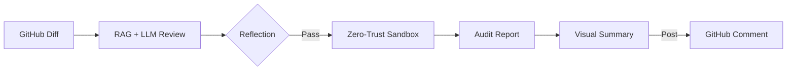
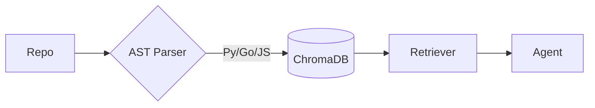
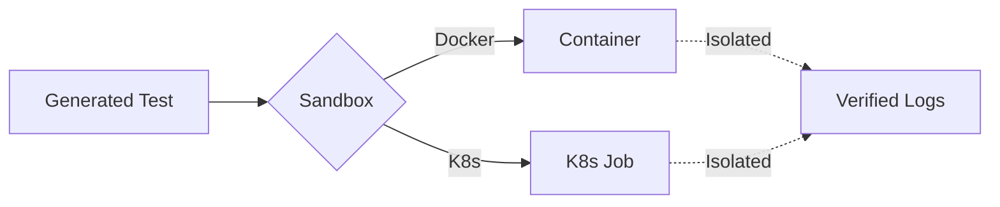
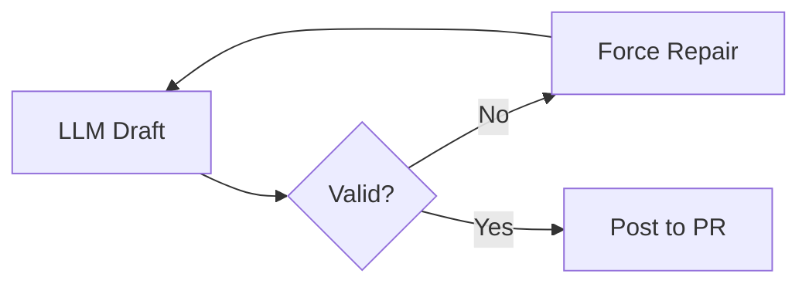
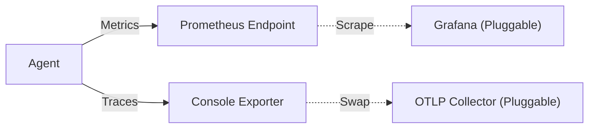

# Secure PR Agent

[](https://www.python.org/downloads/)
[](https://opensource.org/licenses/MIT)
[](https://github.com/psf/black)

A secure, autonomous pull request reviewer using AST-enhanced RAG for context and isolated sandboxes for dynamic verification.

## Architecture

The agent architecture is designed for three things: **Security, Context, and Recovery.**

### 1. High-Level Workflow
The core process uses a deterministic state machine to transition from raw GitHub diffs to a verified security report.



### 2. Context-Aware Indexing (RAG)
Unlike simple "diff-readers," this agent understands your entire codebase. It uses a **Polyglot AST Chunker** to build a semantic map of your repository.



### 3. Zero-Trust Sandbox Execution
Verification scripts are generated as "White-Box" tests and dispatched to hardened, network-isolated environments.



### 4. Self-Healing Visualization
We ensure 100% validity for Mermaid diagrams using a custom "Compiler-in-the-Loop" strategy.



### 5. Observability
The agent integrates **Prometheus** for metrics and **OpenTelemetry** for distributed tracing, providing deep insight into LLM costs, review latency, and system health.



## Setup & Usage

### Quick Start
```bash
pip install .           # 1. Install
cp .env.example .env    # 2. Configure (Add GitHub/OpenAI tokens)
python3 main.py --index . --collection my_project    # 3. Index Codebase (Highly Recommended)
python3 main.py --pr <PR_URL> --collection my_project   # 4. Review PR
```

### Advanced Configuration

<details>
<summary><b>Isolated Sandbox Setup (Optional)</b></summary>

Verification scripts are executed in hardened, network-isolated environments.

**Docker (Local)**:
```bash
docker build -t pr-agent-sandbox:latest -f Dockerfile.sandbox .
# Set SANDBOX_TYPE=docker in .env
```

**Kubernetes (Remote)**:
Set `SANDBOX_TYPE=kubernetes` in `.env`. The agent will dispatch ephemeral Jobs to your cluster for high-scale, zero-trust verification.
</details>

<details>
<summary><b>Remote & Multi-Repo Indexing</b></summary>

Build semantic maps for remote or external repositories:

> [!NOTE]
> Indexing is **100% Local**. It uses local embedding models (CPU/GPU), consumes **Zero LLM Tokens**, and never sends your source code to the LLM provider.

```bash
# Index a Remote Repo
python3 main.py --index https://github.com/owner/repo --collection custom_repo

# Manage Collections
python3 main.py --list-collections
python3 main.py --delete-collection custom_repo
```

**Intelligence without Docstrings**  
Agent uses **Structural Awareness** (AST) to index function signatures, parameter names, and logic flows. Even if your code has zero documentation, the agent "learns" your internal APIs by mapping the relationships between nodes. </details>

<details>
<summary><b>Local LLM Support (Ollama)</b></summary>

Switch to local models for privacy or cost savings:
```bash
ollama pull qwen2.5-coder:7b
python3 main.py --pr <URL> --collection my_repo --provider ollama
```
</details>

<details>
<summary><b>RAG Embedding Models</b></summary>

Configure `EMBEDDING_MODEL` in `.env` to balance accuracy vs. RAM:

| Model | RAM Usage | Best For |
| :--- | :--- | :--- |
| `all-MiniLM-L6-v2` | Low (<1GB) | *Default.* Fast indexing. |
| `BAAI/bge-small-en-v1.5` | Medium (~2GB) | Production-grade accuracy. |
</details>

<details>
<summary><b>Common Flags</b></summary>

- `--rereview`: Bypass idempotency cache and force a fresh audit.
- `--collection`: Specify which codebase context to use for RAG.
</details>

<details>
<summary><b>Data Storage & Persistence</b></summary>

- **RAG Knowledge**: Stored in a local **ChromaDB** vector database located in the `chroma_db/` directory.
- **Metrics**: Exposed on `:8000/metrics`. Stored in-memory (Standard Prometheus format).
- **Traces**: Exported to the **Console** by default (Standard CLI developer experience). The system uses the OpenTelemetry SDK, making it fully pluggable for OTLP collectors (Jaeger/Honeycomb) in production.
</details>

## Development
```bash
pip install -e .
python -m unittest discover tests
```

## License
MIT License. 
